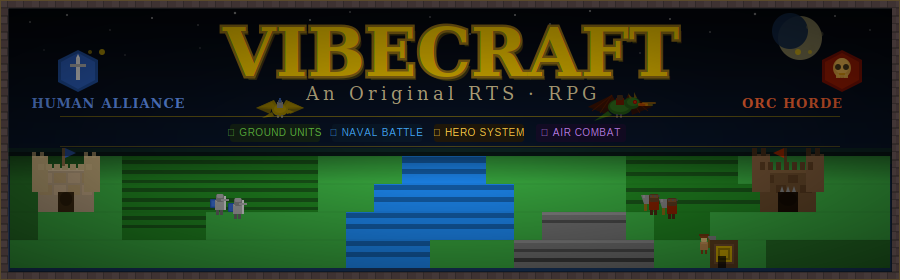

# VibeCraft

<p align="center">
  
</p>

An original RTS game with RPG elements, supporting Versions I, II, and III mechanics.

## Overview

VibeCraft is built with original IP — all graphics and animations are our own. The game is written in [Elixir](https://elixir-lang.org/) and targets the Version III experience while also supporting Version I and II mechanics. We do not reference any third-party protected trademarks (e.g. "WarCraft") anywhere in the project.

## Getting Started

### Prerequisites

- [Elixir](https://elixir-lang.org/install.html) 1.15 or later
- [SDL2](https://www.libsdl.org/) development libraries
- OpenGL 3.3+ (provided by your graphics driver)
- CMake 3.x and a C compiler (GCC or Clang)

**Ubuntu / Debian:**

```sh
sudo apt install libsdl2-dev cmake build-essential
```

**macOS (Homebrew):**

```sh
brew install sdl2 cmake
```

### Build

```sh
mix deps.get
mix compile
```

### Run

```sh
mix run -e "VibeCraft.Demo.run()"
```

Press **Escape** or close the window to exit.

## Game Design Document

See [GDD.md](GDD.md) for the full game design document.

## Gameplay

See [GAMEPLAY.md](GAMEPLAY.md) for a reference on races, units, buildings, and heroes.

## Roadmap

See [ROADMAP.md](ROADMAP.md) for the project plan, milestones, and technology notes.

## Contributing

See [CONTRIBUTING.md](CONTRIBUTING.md) for project guidelines.

## License

[MIT](LICENSE.md)
